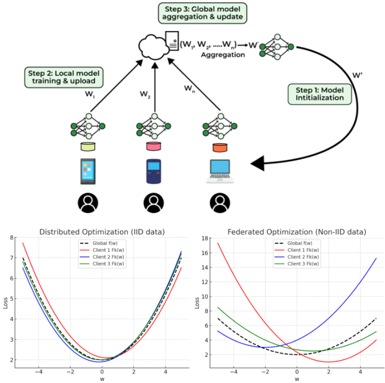
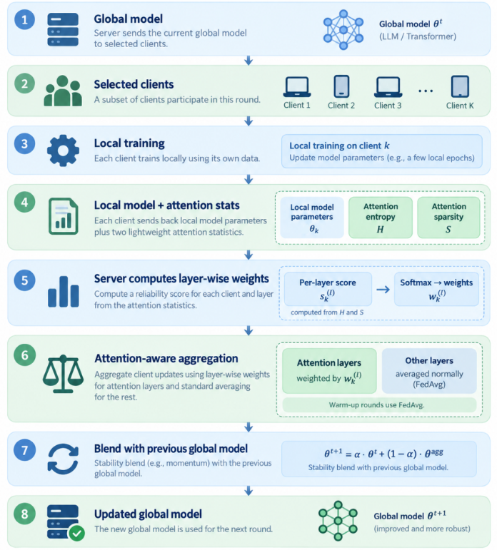
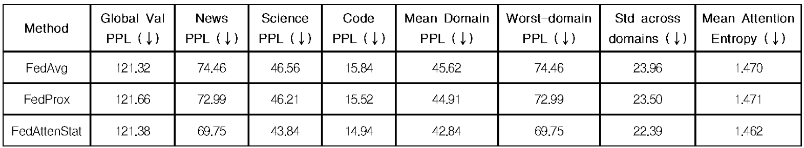

# FedAttention Attention Statistic Weighting for Federated Learning.
A federated learning method that uses Transformer attention statistics to guide how client updates are aggregated under non-IID data.

## Problem statement

**Federative learning** - this is a learning paradigm in which data remains locally with users (on devices), and only updates to model parameters are sent to the server. The server aggregates these updates and creates a new global model.  

  
 
  FL is widely used when data is distributed among clients, but in reality, the clients:
  <ul>
    <li> have different data domains (code, news, scientific texts, etc.) </li>
    <li> don't learn the same way </li>
    <li> produce models of different quality </li>
  </ul>
 
  However, FedAvg averages everyone equally, which results in:
  <ul>
    <li> loss of useful information </li>
    <li> deterioration of quality </li>
    <li> instability with strong domain shift (non-IID) </li>
  </ul>

  

  <i>In some cases, the client is useful, in others not, but FedAvg does not see this.</i>

## Propose approach

The idea is to use the model's internal signal - **self-attention**.
Explanation:
* Stable and confident models have focused and sparse attention (low entropy, high selectivity).
* Noisy/domain-mixed models are the opposite.

This means that the “quality” of a client can be determined based on the structure of its attention.
With this approach, the model is: 
- less sensitive to bad customers,
- more resilient,
- more adaptive

  
   

  Each client performs normal local training and also collects for each Transformer layer (l), attention head (h), and client (k) two signals are computed from the local attention statistics:
  <ul>
    <li><b>Attention entropy:</b> H = -Σ A log A</li>
    <li><b>Attention sparsity:</b> S = (1/N) Σ I(A ≤ ε)</li>
  </ul>

  The server combines these values into a per-layer score:
   <b>Skl = meanh(τe · (1 / Entropyl,h,k) + τs · Sparsityl,h,k </b> 
  And then converts the scores into layer-wise aggregation weights using softmax.

  Higher-weight client updates contribute more strongly to that attention layer, while the rest of the model is averaged normally.

## Results

  

1. **Global Performance:** FedAttention matches or slightly improves global PPL across all seeds.
2. **Domain Robustness:** FedAttention consistently improves worst-domain PPL (up to –10.8 points) and reduces variance across domains.
3. **Non-IID Stability:** FedAttention yields lower per-domain std, indicating more uniform generalization across heterogeneous clients.
4. **Strongest Effect Under Harder Conditions:** With more local steps (180) and more rounds (12), FedAttention shows substantial gains in all domain metrics.
5. **Structural Effects:** Attention entropy decreases across experiments → attention becomes more selective and confident, matching the theoretical motivation.

_FedAttention demonstrates a robust, interpretable, and practically meaningful improvement over FedAvg, especially in non-IID settings._

